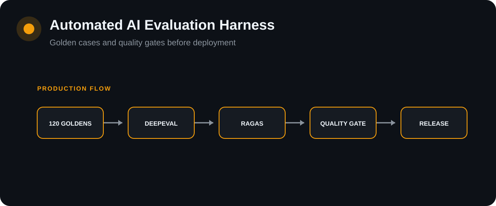

# Automated AI Evaluation Harness

[](https://github.com/Lonfea/ai-evaluation-harness/actions/workflows/ci.yml)


<p align="center"></p>

A regression-testing system for AI applications with **120 committed golden cases**, DeepEval and RAGAS quality metrics, optional LangSmith tracing, and a quality gate that can fail deployment when model behavior degrades.

## Why this exists

Traditional unit tests catch deterministic software bugs. They do not answer whether an LLM response became less faithful, less relevant, or worse at citing evidence after a prompt, retrieval, model, or infrastructure change.

This harness treats AI quality as a release criterion.

## Release architecture

<pre>
Code / Prompt / Model Change
          |
          v
     GitHub Actions
          |
          v
  Deterministic Tests
          |
          v
   120 Golden Cases
      /         \
     v           v
 DeepEval       RAGAS
      \         /
       v       v
      Quality Gate --------> LangSmith traces
       /       \
    PASS       REGRESSION
      |             |
      v             v
 Deployment       BLOCKED
</pre>

## Quality gate

<pre>
Candidate Evaluation
        |
        v
Meets absolute thresholds?
   | YES          | NO
   v              v
Baseline?      FAIL RELEASE
   |
   +-- NO --> PASS ABSOLUTE GATE
   |
   +-- YES --> Regression > tolerance?
                    | YES       | NO
                    v           v
                FAIL RELEASE    PASS
</pre>

## What this demonstrates

This repository treats **model behavior as testable release quality**, not an informal manual check. It separates deterministic contract validation from probabilistic quality evaluation and makes regressions capable of blocking deployment.

## Does the gate catch bad releases?

An evaluation harness is only useful if it fails bad systems. `scripts/meta_eval.py` runs the golden suite against reference systems that each have one planted defect, plus a correct oracle, and records the gate's decision. It uses deterministic checks only, so the result is exact and reproducible without a judge model or API key.

| System | Current gate | v1 deterministic check | Pass rate |
|---|---|---|---:|
| oracle (correct) | passed | passed | 1.00 |
| cites every retrieved page | blocked | passed | 0.25 |
| never abstains (invents figures) | blocked | passed | 0.75 |
| always abstains | blocked | blocked | 0.25 |
| follows distractor passage | blocked | blocked | 0.75 |
| uses superseded draft | blocked | blocked | 0.75 |
| right page, wrong number | blocked | passed | 0.75 |

The current gate blocks **6 of 6** defective systems and passes the oracle. The v1 check (expected citations must be a subset of cited pages) blocked 3:

- It passed a system that **cites every retrieved page**, because a superset of citations still contains the expected ones.
- It passed a system that **invents figures for unanswerable questions**, because `should_refuse` was never checked.
- It passed a system that **cites the right page but misreads the number**, because answer content was never compared.

v1 also ran LLM judges, which may catch some of these through low faithfulness scores. That was not measured here. The point is that these failures no longer depend on a judge model noticing them.

The meta-evaluation also runs as a unit test, so CI fails if a change stops the gate from catching any of these defects.

```bash
python scripts/meta_eval.py --output reports/meta_eval.json
```

## Evaluation layers

1. **Deterministic checks** (every case, no model needed)
   - citation precision and recall: cited pages must equal the golden pages;
   - refusal correctness: abstain exactly when `should_refuse` is true;
   - fact match: numbers and identifiers in the expected answer must appear in the response.

2. **LLM-judge metrics** (optional, `--judges deepeval|ragas|all`)
   - DeepEval and RAGAS faithfulness and answer relevancy;
   - skipped for refusal cases, where there are no claims to judge.

3. **Regression gate**
   - absolute minimum for every metric the run computed;
   - minimum pass rate for **each category**, so one collapsed failure mode cannot hide inside a good average;
   - comparison with an approved baseline, overall and per category;
   - deployment blocked when any drop exceeds tolerance.

4. **Traceability**
   - target calls are decorated with LangSmith `traceable`;
   - set `LANGSMITH_TRACING=true` and credentials to record full runs.

## Golden suite

`goldens/goldens.jsonl` contains 120 synthetic cases: 30 for each of four failure modes. They are **templated**: within a category, cases differ only in their numbers and page positions. `scripts/generate_goldens.py` reproduces the file exactly, and a test checks that it still does.

Templating keeps every expected answer and citation easy to audit, but it tests behaviour, not language understanding. A model that handles these 120 cases may still fail on real questions. Treat this suite as a regression floor, and add hand-reviewed cases from your own domain alongside it.

## Target contract

Set `TARGET_URL` to an endpoint that accepts:

    {
      "input": "...",
      "retrieval_context": ["..."]
    }

and returns:

    {
      "answer": "...",
      "retrieval_context": ["..."],
      "citations": [31]
    }

`citations` are page numbers as they appear in the retrieval context: a passage starting `Page 31:` is cited as `31`.

v0.1 also sent `expected_output` to the target, so a system could pass by echoing the answer key. The request no longer includes it.

This makes the harness usable against a local service, preview deployment, or production canary.

## Golden-suite composition

| Failure mode | What the suite checks |
|---|---|
| Grounded factual QA | answer is supported by supplied context |
| Distractor resistance | irrelevant context does not dominate |
| Unanswerable questions | model abstains instead of hallucinating |
| Conflicting evidence | response handles contradictory context |

## Run deterministic CI

    pytest -q
    ruff check .

## Run the quality gate

    # deterministic checks only: needs just the target service
    python -m app.runner --judges none

    # with LLM judges: also needs EVAL_MODEL and its API key
    python -m app.runner --judges all

Results are written to `reports/latest.json`. If the target fails on a case (timeout, HTTP error, invalid JSON), that case fails and records the error, and the rest of the suite still runs.

## Baselines

A baseline is only created from a **real completed run**. This repository intentionally does not ship fabricated quality scores.

To approve a real run:

    cp reports/latest.json <review-and-extract-aggregate-to-baseline>

## Release policy

Default thresholds, each overridable by the environment variable in brackets:
- pass rate >= 0.90 (`MIN_PASS_RATE`)
- citation accuracy >= 0.95 (`MIN_CITATION_ACCURACY`)
- refusal accuracy >= 0.95 (`MIN_REFUSAL_ACCURACY`)
- fact accuracy >= 0.95 (`MIN_FACT_ACCURACY`)
- every category's pass rate >= 0.80 (`MIN_CATEGORY_PASS_RATE`)
- mean faithfulness >= 0.85 and answer relevancy >= 0.80, when judges run
- no tracked metric or category may regress by more than 0.03 from the approved baseline (`MAX_REGRESSION`)

`MIN_CITATION_ACCURACY` was documented in v0.1 but not read from the environment. It is now.

## Known limitations

- **Fact matching is lexical.** It checks that numbers and identifiers appear, so "101" matches even in "not 101". It is a floor, not a substitute for a judge.
- **Abstention detection uses phrase patterns.** An unusual refusal ("I'd rather not guess") is not recognized. Check `abstained` in the report when refusal accuracy drops unexpectedly.
- **No baseline is shipped.** Create one from a real run with a real target, not from the oracle.
